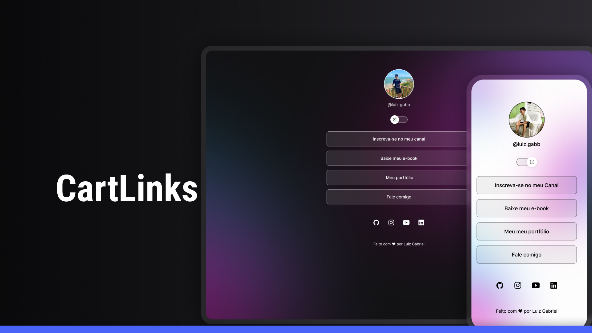

<h1 align="center"> CartLinks </h1>

  

  

 

## 🚀 Tecnologias

Esse projeto foi desenvolvido com as seguintes tecnologias:

1. HTML e CSS
2. JavaScript
3. Git e Github
4. Figma

## 💻 Projeto

O CartLinks é um agregador de links para usar como cartão de visitas online.

Entre nesse link para acessar o projeto : https://luizgabb.github.io/Cartlink/ 

## :memo: Licença

Esse projeto está sob a licença MIT.

---

Feito com ♥ por Luiz Gabriel
